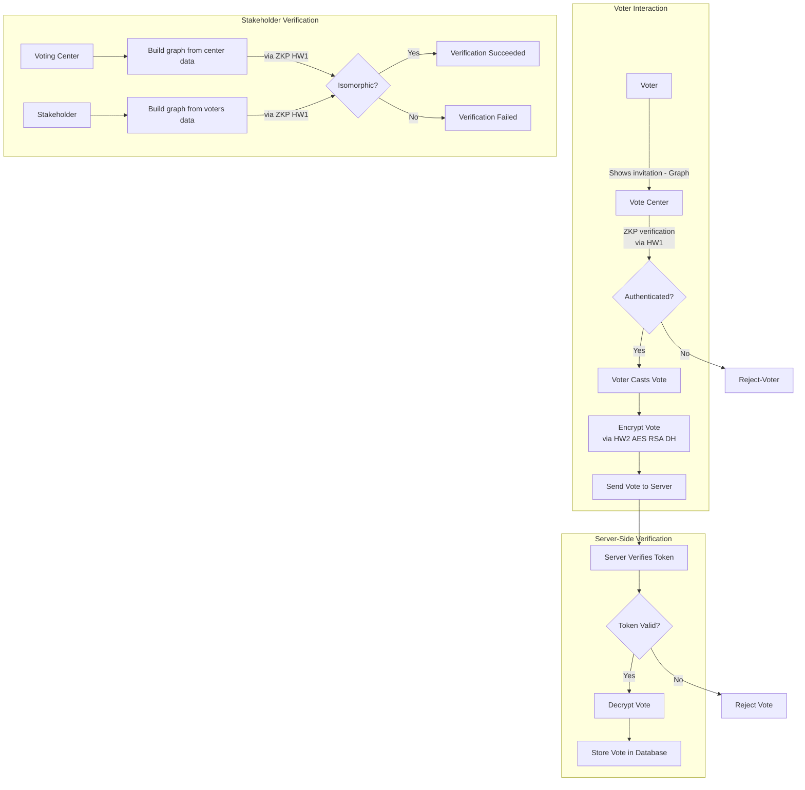

## Flow Diagram

```mermaid

flowchart TD
    C -- No --> Reject-Voter

    F --> G[Encrypt Vote
            via HW2 AES RSA DH]
    H --> I[Server Verifies Token]
    J -- No --> L[Reject Vote]

    subgraph Voter Interaction
        A[Voter] -->|Shows invitation - Graph| B[Vote Center]
        B --> |ZKP verification
                via HW1| C{Authenticated?}
        C -- Yes --> F[Voter Casts Vote]
        G --> H[Send Vote to Server]
    end

    subgraph Server-Side Verification
        I --> J{Token Valid?}
        J -- Yes --> K[Decrypt Vote]
        K --> M[Store Vote in Database]
    end

    subgraph Stakeholder Verification
        P[Stakeholder]
        PQ[Voting Center]
        P --> Q[Build graph from voters data]
        PQ --> R[Build graph from center data]

        R --> |via ZKP HW1| S{Isomorphic?}
        Q --> |via ZKP HW1| S
        S -- Yes --> T[Verification Succeeded]
        S -- No --> U[Verification Failed]
    end
```